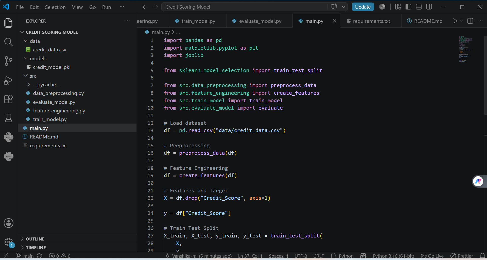
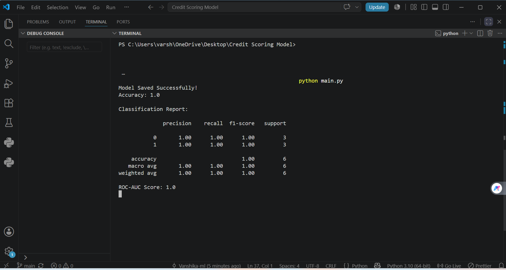
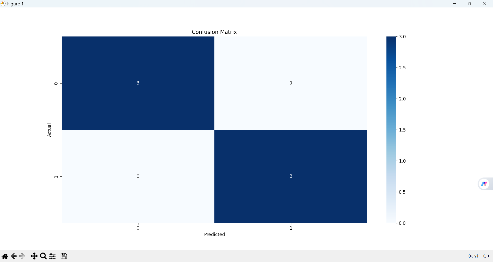
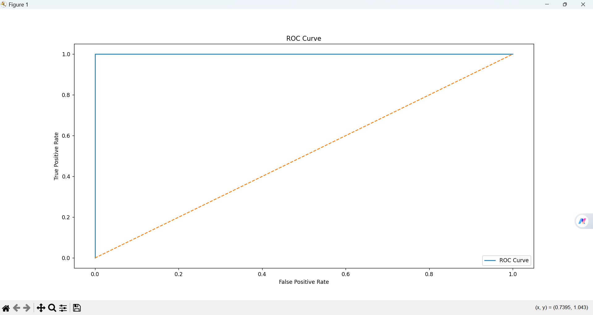
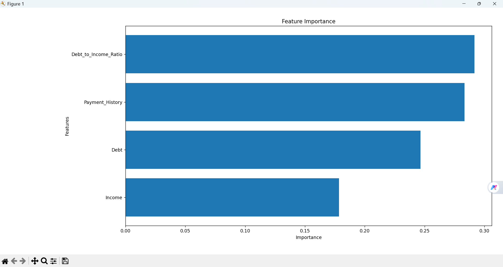

# Credit Scoring Model

## Objective

Predict an individual's creditworthiness using historical financial data.

## Features

- Income
- Debt
- Payment History
- Debt to Income Ratio

## Algorithms

- Random Forest Classifier

## Evaluation Metrics

- Accuracy
- Precision
- Recall
- F1 Score
- ROC-AUC

## Tech Stack

- Python
- Pandas
- NumPy
- Scikit-Learn

## Run Project

```bash
python main.py
```

## Screenshots

### Project Structure



### Terminal Output



### Confusion Matrix



### ROC Curve



### Feature Importance


